# Technical Architecture Document

**Document Version**: 1.0  
**Last Updated**: September 2025  
**Document Owner**: Engineering Architecture Team  
**Review Cycle**: Monthly

---

## Executive Summary

The `helpme-cli` technical architecture implements a model-agnostic, privacy-first AI assistant that seamlessly integrates with existing developer workflows. The system prioritizes local processing, user agency, and extensibility while maintaining high performance and reliability across diverse environments.

**Key Architectural Principles**:
- **Model Agnosticism**: Support for multiple AI providers through abstraction layers
- **Privacy by Design**: Local processing preferred, minimal data transmission
- **User Agency**: All system changes require explicit user consent  
- **Extensibility**: Plugin architecture for community-driven enhancements
- **Performance**: Sub-2-second response times for common queries
- **Safety**: Multi-layered safety mechanisms preventing harmful operations

---

## System Overview

### High-Level Architecture

```mermaid
graph TB
    User[👤 User] --> CLI[helpme-cli]
    CLI --> Router[Command Router]
    Router --> Parser[Intent Parser]
    Parser --> Context[Context Manager]
    Context --> Engine[AI Engine]
    Engine --> Local[Local Models]
    Engine --> Cloud[Cloud APIs]
    Engine --> Safety[Safety Layer]
    Safety --> Executor[Command Executor]
    Executor --> Plugins[Plugin System]
    
    subgraph "AI Providers"
        Local --> LocalLLM[Ollama/Local LLM]
        Cloud --> Claude[Claude API]
        Cloud --> GPT[OpenAI GPT]
        Cloud --> Gemini[Google Gemini]
        Cloud --> Others[Other APIs]
    end
    
    subgraph "Plugin Ecosystem"
        Plugins --> Docker[Docker Plugin]
        Plugins --> Git[Git Plugin]
        Plugins --> K8s[Kubernetes Plugin]
        Plugins --> AWS[AWS Plugin]
        Plugins --> Custom[Custom Plugins]
    end
    
    subgraph "Storage Layer"
        Context --> Config[User Config]
        Context --> History[Command History]
        Context --> Cache[Response Cache]
        Context --> State[Session State]
    end
```



### Core Components Architecture

#### 1. Command Router & Intent Parser
**Purpose**: Transforms natural language input into structured, actionable intents

```rust
// Simplified architecture pseudocode
pub struct CommandRouter {
    parsers: Vec<Box<dyn IntentParser>>,
    context_manager: Arc<ContextManager>,
    ai_engine: Arc<AIEngine>,
}

pub enum Intent {
    Query(QueryIntent),           // "what is X?"
    Execute(ExecutionIntent),     // "do X"
    Explain(ExplanationIntent),   // "explain X"  
    Diagnose(DiagnosticIntent),   // "why is X broken?"
    Learn(LearningIntent),        // "teach me X"
}

impl CommandRouter {
    pub async fn route(&self, input: &str) -> Result<Response> {
        let context = self.context_manager.get_context().await?;
        let intent = self.parse_intent(input, &context).await?;
        let response = self.ai_engine.process(intent, context).await?;
        Ok(response)
    }
}
```

**Key Features**:
- **Multi-stage parsing**: Combines rule-based and AI-powered intent recognition
- **Context awareness**: Incorporates user environment, history, and preferences
- **Ambiguity resolution**: Interactive clarification for unclear requests
- **Progressive complexity**: Handles everything from simple queries to complex workflows

#### 2. Model-Agnostic AI Engine
**Purpose**: Abstracts AI provider differences, enabling seamless model switching

```rust
pub trait AIProvider {
    async fn generate(&self, prompt: &Prompt, config: &Config) -> Result<AIResponse>;
    fn capabilities(&self) -> ProviderCapabilities;
    fn cost_estimate(&self, prompt: &Prompt) -> CostEstimate;
    fn privacy_level(&self) -> PrivacyLevel;
}

pub struct AIEngine {
    providers: HashMap<ProviderId, Box<dyn AIProvider>>,
    router: ProviderRouter,
    cache: ResponseCache,
    safety_layer: SafetyLayer,
}

impl AIEngine {
    pub async fn process(&self, intent: Intent, context: Context) -> Result<Response> {
        let provider = self.router.select_provider(&intent, &context)?;
        let prompt = self.build_prompt(&intent, &context)?;
        
        // Check cache first
        if let Some(cached) = self.cache.get(&prompt).await? {
            return Ok(cached);
        }
        
        // Safety pre-check
        self.safety_layer.validate_prompt(&prompt)?;
        
        // Generate response
        let raw_response = provider.generate(&prompt, &context.config).await?;
        
        // Safety post-check  
        let safe_response = self.safety_layer.validate_response(&raw_response)?;
        
        // Cache and return
        self.cache.store(&prompt, &safe_response).await?;
        Ok(safe_response)
    }
}
```

#### 3. Context Manager
**Purpose**: Maintains user environment awareness and session state

```rust
pub struct ContextManager {
    system_info: SystemInfoCollector,
    user_preferences: UserPreferences,
    session_state: SessionState,
    history_manager: HistoryManager,
}

#[derive(Debug, Clone)]
pub struct Context {
    // System environment
    pub os: OperatingSystem,
    pub shell: Shell,
    pub working_directory: PathBuf,
    pub installed_tools: Vec<Tool>,
    pub environment_variables: HashMap<String, String>,
    
    // User context
    pub user_preferences: UserPreferences,
    pub expertise_level: ExpertiseLevel,
    pub current_project: Option<ProjectContext>,
    
    // Session context
    pub command_history: Vec<CommandHistoryEntry>,
    pub current_task: Option<TaskContext>,
    pub conversation_history: Vec<ConversationEntry>,
}

impl ContextManager {
    pub async fn get_context(&self) -> Result<Context> {
        let system_info = self.system_info.collect().await?;
        let user_prefs = self.user_preferences.load().await?;
        let session_state = self.session_state.current().await?;
        
        Ok(Context {
            os: system_info.os,
            shell: system_info.shell,
            working_directory: system_info.cwd,
            installed_tools: system_info.tools,
            user_preferences: user_prefs,
            // ... other context fields
        })
    }
}
```

#### 4. Safety Layer Architecture
**Purpose**: Multi-layered safety mechanisms preventing harmful operations

```rust
pub struct SafetyLayer {
    command_classifier: CommandClassifier,
    risk_assessor: RiskAssessor,
    permission_manager: PermissionManager,
    sandbox_executor: SandboxExecutor,
}

#[derive(Debug, Clone)]
pub enum SafetyLevel {
    Safe,        // Read-only operations, documentation lookup
    Cautious,    // Configuration changes, package installation
    Dangerous,   // System modifications, file deletion
    Critical,    // Production systems, irreversible operations
}

impl SafetyLayer {
    pub fn classify_command(&self, command: &str) -> SafetyLevel {
        // Rule-based classification with AI augmentation
        match self.command_classifier.classify(command) {
            // Dangerous patterns
            _ if command.contains("rm -rf") => SafetyLevel::Critical,
            _ if command.contains("sudo") => SafetyLevel::Dangerous,
            _ if command.contains("kubectl delete") => SafetyLevel::Critical,
            
            // Package management
            _ if command.starts_with("npm install") => SafetyLevel::Cautious,
            _ if command.starts_with("pip install") => SafetyLevel::Cautious,
            
            // Safe operations  
            _ if command.starts_with("ls") => SafetyLevel::Safe,
            _ if command.starts_with("cat") => SafetyLevel::Safe,
            
            // AI-powered classification for complex cases
            _ => self.ai_classify(command),
        }
    }
    
    pub async fn execute_safely(&self, command: &str, context: &Context) -> Result<ExecutionResult> {
        let safety_level = self.classify_command(command);
        
        match safety_level {
            SafetyLevel::Safe => self.execute_directly(command).await,
            SafetyLevel::Cautious => {
                self.request_permission(command, "This will modify your system configuration").await?;
                self.execute_directly(command).await
            },
            SafetyLevel::Dangerous => {
                self.request_permission(command, "This is a potentially dangerous operation").await?;
                self.sandbox_executor.execute_with_monitoring(command).await
            },
            SafetyLevel::Critical => {
                self.request_explicit_confirmation(command).await?;
                self.sandbox_executor.execute_with_full_backup(command).await
            }
        }
    }
}
```

#### 5. Plugin System Architecture
**Purpose**: Extensible plugin system for domain-specific functionality

```rust
pub trait Plugin {
    fn name(&self) -> &str;
    fn version(&self) -> &str;
    fn capabilities(&self) -> Vec<Capability>;
    
    async fn handle_intent(&self, intent: &Intent, context: &Context) -> Result<PluginResponse>;
    fn supports_intent(&self, intent: &Intent) -> bool;
}

pub struct PluginManager {
    plugins: HashMap<String, Box<dyn Plugin>>,
    registry: PluginRegistry,
    loader: PluginLoader,
}

// Example Docker plugin
pub struct DockerPlugin {
    docker_client: Docker,
}

impl Plugin for DockerPlugin {
    fn name(&self) -> &str { "docker" }
    
    fn capabilities(&self) -> Vec<Capability> {
        vec![
            Capability::ContainerManagement,
            Capability::ImageOperations,
            Capability::NetworkDiagnostics,
            Capability::VolumeManagement,
        ]
    }
    
    async fn handle_intent(&self, intent: &Intent, context: &Context) -> Result<PluginResponse> {
        match intent {
            Intent::Diagnose(diag) if diag.domain == "docker" => {
                let containers = self.docker_client.list_containers(None).await?;
                let issues = self.analyze_containers(&containers)?;
                Ok(PluginResponse::Diagnosis(issues))
            },
            Intent::Execute(exec) if exec.tool == "docker" => {
                let safety_level = self.assess_docker_command(&exec.command)?;
                Ok(PluginResponse::ExecutionPlan {
                    commands: vec![exec.command.clone()],
                    safety_level,
                    explanation: self.explain_command(&exec.command)?,
                })
            },
            _ => Ok(PluginResponse::NotHandled),
        }
    }
}
```

---

## Model Integration Architecture

### AI Provider Abstraction

#### Provider Selection Logic
```rust
pub struct ProviderRouter {
    selection_strategy: SelectionStrategy,
    fallback_chain: Vec<ProviderId>,
    performance_monitor: PerformanceMonitor,
}

#[derive(Debug, Clone)]
pub enum SelectionStrategy {
    UserPreference,           // Respect user's explicit choice
    CostOptimized,           // Minimize cost per query
    PerformanceOptimized,    // Minimize latency  
    PrivacyMaximized,        // Prefer local processing
    QualityOptimized,        // Best response quality
    ContextAware,            // Choose based on query type
}

impl ProviderRouter {
    pub fn select_provider(&self, intent: &Intent, context: &Context) -> Result<ProviderId> {
        match self.selection_strategy {
            SelectionStrategy::PrivacyMaximized => {
                // Prefer local models for sensitive operations
                if context.contains_sensitive_data() {
                    return Ok(ProviderId::Local);
                }
            },
            SelectionStrategy::QualityOptimized => {
                // Use Claude for complex reasoning, GPT for creative tasks
                match intent.complexity_level() {
                    ComplexityLevel::High => Ok(ProviderId::Claude),
                    ComplexityLevel::Creative => Ok(ProviderId::GPT),
                    _ => Ok(ProviderId::Local),
                }
            },
            SelectionStrategy::ContextAware => {
                // Emergency situations get fastest provider
                if context.is_emergency_context() {
                    return self.fastest_available_provider();
                }
                // Learning contexts get most explanatory provider
                if context.is_learning_context() {
                    return Ok(ProviderId::Claude);
                }
            },
            _ => self.default_provider_selection(context),
        }
    }
}
```

#### Local Model Integration
```rust
pub struct LocalModelProvider {
    ollama_client: OllamaClient,
    available_models: Vec<LocalModel>,
    model_selector: LocalModelSelector,
}

#[derive(Debug)]
pub struct LocalModel {
    name: String,
    size: u64,
    capabilities: ModelCapabilities,
    performance_profile: PerformanceProfile,
}

impl AIProvider for LocalModelProvider {
    async fn generate(&self, prompt: &Prompt, config: &Config) -> Result<AIResponse> {
        let model = self.model_selector.select_model(prompt, config)?;
        
        // Optimize prompt for local model constraints
        let optimized_prompt = self.optimize_for_local(&prompt, &model)?;
        
        let response = self.ollama_client.generate(GenerationRequest {
            model: model.name.clone(),
            prompt: optimized_prompt.text,
            options: GenerationOptions {
                temperature: config.creativity_level,
                max_tokens: self.calculate_max_tokens(&model, &prompt)?,
                stop_sequences: vec!["\n\n".to_string()], // Prevent over-generation
            },
        }).await?;
        
        Ok(AIResponse {
            text: response.response,
            confidence: self.estimate_confidence(&response)?,
            provider: ProviderId::Local,
            model: model.name,
            processing_time: response.total_duration,
        })
    }
    
    fn privacy_level(&self) -> PrivacyLevel {
        PrivacyLevel::Maximum // No data leaves the user's machine
    }
}
```

#### Cloud Provider Integration
```rust
pub struct ClaudeProvider {
    client: AnthropicClient,
    rate_limiter: RateLimiter,
    cost_tracker: CostTracker,
}

impl AIProvider for ClaudeProvider {
    async fn generate(&self, prompt: &Prompt, config: &Config) -> Result<AIResponse> {
        // Rate limiting
        self.rate_limiter.wait_if_needed().await?;
        
        // Cost estimation and user notification
        let estimated_cost = self.cost_estimate(prompt);
        if estimated_cost.exceeds_threshold(&config.cost_limits) {
            return Err(AIError::CostThresholdExceeded(estimated_cost));
        }
        
        let response = self.client.messages().create(CreateMessageRequest {
            model: "claude-3-sonnet-20240229",
            max_tokens: prompt.max_tokens.unwrap_or(1000),
            messages: vec![Message {
                role: "user".to_string(),
                content: prompt.to_anthropic_format()?,
            }],
        }).await?;
        
        // Track usage for billing/limits
        self.cost_tracker.record_usage(&response).await?;
        
        Ok(AIResponse {
            text: response.content[0].text.clone(),
            confidence: self.extract_confidence(&response)?,
            provider: ProviderId::Claude,
            model: response.model,
            processing_time: response.usage.processing_time,
        })
    }
}
```

---

## Privacy and Security Architecture

### Data Flow and Privacy Protection

#### Sensitive Data Detection and Handling
```rust
pub struct PrivacyGuard {
    sensitive_pattern_detector: SensitivePatternDetector,
    anonymizer: DataAnonymizer,
    local_processor: LocalProcessor,
}

impl PrivacyGuard {
    pub async fn process_query(&self, query: &str, context: &Context) -> Result<ProcessedQuery> {
        let sensitivity_analysis = self.analyze_sensitivity(query, context).await?;
        
        match sensitivity_analysis.level {
            SensitivityLevel::Public => {
                // Safe to send to cloud providers
                Ok(ProcessedQuery::CloudSafe(query.to_string()))
            },
            SensitivityLevel::Personal => {
                // Anonymize before sending to cloud
                let anonymized = self.anonymizer.anonymize(query)?;
                Ok(ProcessedQuery::Anonymized(anonymized))
            },
            SensitivityLevel::Confidential => {
                // Process locally only
                let response = self.local_processor.process(query, context).await?;
                Ok(ProcessedQuery::LocalOnly(response))
            },
            SensitivityLevel::Secret => {
                // Refuse to process or ask for clarification
                Ok(ProcessedQuery::RequiresConfirmation {
                    reason: "This query contains sensitive information",
                    safe_alternative: self.suggest_safe_alternative(query)?,
                })
            }
        }
    }
}

#[derive(Debug)]
pub enum SensitiveDataType {
    APIKeys,
    Passwords,
    PersonalPaths,
    InternalURLs,
    DatabaseConnectionStrings,
    CertificateData,
    EnvironmentSecrets,
}
```

#### Encryption and Secure Communication
```rust
pub struct SecureCommunicationLayer {
    tls_config: TlsConfig,
    certificate_validator: CertificateValidator,
    request_signer: RequestSigner,
}

impl SecureCommunicationLayer {
    pub async fn send_request(&self, request: &APIRequest) -> Result<APIResponse> {
        // Validate TLS certificates
        self.certificate_validator.validate(&request.endpoint)?;
        
        // Sign request for integrity
        let signed_request = self.request_signer.sign(request)?;
        
        // Use secure TLS configuration
        let client = reqwest::Client::builder()
            .use_preconfigured_tls(self.tls_config.clone())
            .timeout(Duration::from_secs(30))
            .build()?;
            
        let response = client.send(signed_request).await?;
        
        // Verify response signature
        self.verify_response_integrity(&response)?;
        
        Ok(response)
    }
}
```

---

## Performance and Scalability

### Response Time Optimization

#### Caching Strategy
```rust
pub struct ResponseCache {
    memory_cache: Arc<Mutex<LruCache<QueryHash, CachedResponse>>>,
    disk_cache: DiskCache,
    cache_policy: CachePolicy,
}

#[derive(Debug, Clone)]
pub struct CachePolicy {
    memory_ttl: Duration,
    disk_ttl: Duration,
    max_memory_entries: usize,
    max_disk_size: u64,
    cache_sensitive_queries: bool,
}

impl ResponseCache {
    pub async fn get(&self, query: &ProcessedQuery) -> Option<AIResponse> {
        let query_hash = self.hash_query(query);
        
        // Check memory cache first (fastest)
        if let Some(cached) = self.memory_cache.lock().await.get(&query_hash) {
            if !cached.is_expired() {
                return Some(cached.response.clone());
            }
        }
        
        // Check disk cache (slower but persistent)  
        if let Ok(Some(cached)) = self.disk_cache.get(&query_hash).await {
            if !cached.is_expired() {
                // Promote to memory cache
                self.memory_cache.lock().await.put(query_hash, cached.clone());
                return Some(cached.response);
            }
        }
        
        None
    }
    
    pub async fn store(&self, query: &ProcessedQuery, response: &AIResponse) -> Result<()> {
        let query_hash = self.hash_query(query);
        let cached = CachedResponse {
            response: response.clone(),
            timestamp: Instant::now(),
            ttl: self.calculate_ttl(query, response),
        };
        
        // Store in memory cache
        self.memory_cache.lock().await.put(query_hash, cached.clone());
        
        // Store in disk cache if policy allows
        if self.should_persist_to_disk(query, response) {
            self.disk_cache.store(query_hash, cached).await?;
        }
        
        Ok(())
    }
}
```

#### Parallel Processing Architecture
```rust
pub struct ParallelProcessor {
    thread_pool: ThreadPool,
    semaphore: Arc<Semaphore>,
    task_scheduler: TaskScheduler,
}

impl ParallelProcessor {
    pub async fn process_complex_query(&self, query: &ComplexQuery) -> Result<AIResponse> {
        let subtasks = self.decompose_query(query)?;
        let semaphore = Arc::clone(&self.semaphore);
        
        let subtask_futures: Vec<_> = subtasks
            .into_iter()
            .map(|subtask| {
                let semaphore = Arc::clone(&semaphore);
                async move {
                    let _permit = semaphore.acquire().await?;
                    self.process_subtask(subtask).await
                }
            })
            .collect();
        
        // Execute subtasks in parallel with concurrency limiting
        let results = futures::future::try_join_all(subtask_futures).await?;
        
        // Combine results intelligently
        self.synthesize_results(results, query).await
    }
}
```

### Scalability Considerations

#### Horizontal Scaling Architecture
```rust
pub struct ScalableArchitecture {
    load_balancer: LoadBalancer,
    instance_pool: InstancePool,
    shared_cache: DistributedCache,
    message_queue: MessageQueue,
}

// For future cloud deployment
impl ScalableArchitecture {
    pub async fn handle_request(&self, request: UserRequest) -> Result<Response> {
        // Route to least loaded instance
        let instance = self.load_balancer.select_instance().await?;
        
        // Check distributed cache first
        if let Some(cached) = self.shared_cache.get(&request.hash()).await? {
            return Ok(cached);
        }
        
        // Process on selected instance
        let response = instance.process(request).await?;
        
        // Cache result for other instances
        self.shared_cache.store(&request.hash(), &response).await?;
        
        Ok(response)
    }
}
```

---

## Integration Points

### System Integration
```rust
pub struct SystemIntegration {
    git_integration: GitIntegration,
    docker_integration: DockerIntegration,
    kubernetes_integration: K8sIntegration,
    package_managers: Vec<Box<dyn PackageManager>>,
}

// Example Git integration
pub struct GitIntegration {
    repo_analyzer: RepoAnalyzer,
    branch_manager: BranchManager,
    commit_helper: CommitHelper,
}

impl GitIntegration {
    pub async fn analyze_current_situation(&self) -> Result<GitContext> {
        let repo_root = self.find_repo_root()?;
        let current_branch = self.get_current_branch(&repo_root).await?;
        let status = self.get_status(&repo_root).await?;
        let recent_commits = self.get_recent_commits(&repo_root, 10).await?;
        
        Ok(GitContext {
            repo_root,
            current_branch,
            status,
            recent_commits,
            upstream_info: self.get_upstream_info(&repo_root).await?,
        })
    }
    
    pub async fn suggest_workflow(&self, intent: &Intent, git_context: &GitContext) -> Result<GitWorkflow> {
        match intent {
            Intent::Execute(exec) if exec.tool == "git" => {
                self.suggest_git_commands(&exec.command, git_context).await
            },
            Intent::Diagnose(diag) if diag.domain == "git" => {
                self.diagnose_git_issues(git_context).await  
            },
            _ => Ok(GitWorkflow::NotApplicable),
        }
    }
}
```

---

## Deployment and Operations

### Deployment Architecture
```rust
pub struct DeploymentConfig {
    target_platforms: Vec<Platform>,
    distribution_channels: Vec<DistributionChannel>,
    update_strategy: UpdateStrategy,
    configuration_management: ConfigurationManagement,
}

#[derive(Debug, Clone)]
pub enum Platform {
    Linux { distributions: Vec<LinuxDistribution> },
    MacOS { versions: Vec<MacOSVersion> },
    Windows { versions: Vec<WindowsVersion> },
}

#[derive(Debug, Clone)]
pub enum DistributionChannel {
    CargoRegistry,
    Homebrew,
    AptRepository,
    SnapStore,
    WindowsPackageManager,
    DirectDownload,
}

impl DeploymentConfig {
    pub fn generate_install_script(&self, platform: &Platform) -> Result<InstallScript> {
        match platform {
            Platform::Linux { .. } => Ok(InstallScript::Bash(self.linux_install_script()?)),
            Platform::MacOS { .. } => Ok(InstallScript::Bash(self.macos_install_script()?)),
            Platform::Windows { .. } => Ok(InstallScript::PowerShell(self.windows_install_script()?)),
        }
    }
}
```

### Monitoring and Observability
```rust
pub struct ObservabilityStack {
    metrics_collector: MetricsCollector,
    log_aggregator: LogAggregator,
    trace_collector: TraceCollector,
    alerting_system: AlertingSystem,
}

#[derive(Debug)]
pub struct SystemMetrics {
    response_times: ResponseTimeMetrics,
    accuracy_metrics: AccuracyMetrics,
    user_satisfaction: SatisfactionMetrics,
    safety_metrics: SafetyMetrics,
    resource_usage: ResourceMetrics,
}

impl ObservabilityStack {
    pub async fn collect_metrics(&self) -> Result<SystemMetrics> {
        Ok(SystemMetrics {
            response_times: self.metrics_collector.get_response_times().await?,
            accuracy_metrics: self.metrics_collector.get_accuracy_metrics().await?,
            user_satisfaction: self.metrics_collector.get_satisfaction_metrics().await?,
            safety_metrics: self.metrics_collector.get_safety_metrics().await?,
            resource_usage: self.metrics_collector.get_resource_metrics().await?,
        })
    }
}
```

---

## Future Architecture Considerations

### Extensibility Roadmap
1. **Advanced Plugin System**: WebAssembly-based plugins for enhanced security and performance
2. **Federated Learning**: Privacy-preserving model improvement from user interactions
3. **Multi-modal Support**: Integration of code analysis, documentation parsing, and visual interfaces
4. **Edge Computing**: Local processing capabilities for improved privacy and performance
5. **Collaborative Features**: Team-shared knowledge bases and collaborative problem-solving

### Technology Evolution Adaptation
- **Model Architecture Changes**: Flexible adapter pattern for new AI architectures
- **Protocol Updates**: Versioned API contracts for backward compatibility
- **Security Enhancements**: Quantum-resistant cryptography preparation
- **Performance Optimization**: Integration with emerging high-performance computing platforms

---

## Conclusion

This technical architecture establishes `helpme-cli` as a robust, scalable, and ethically-designed AI assistant. The model-agnostic design ensures longevity and user choice, while the privacy-first approach maintains user trust. The extensible plugin system enables community-driven innovation while maintaining system safety and reliability.

The architecture balances multiple competing priorities:
- **Performance vs. Privacy**: Local processing preferred, cloud for complex tasks
- **Safety vs. Usability**: Progressive permission model prevents harm while maintaining efficiency
- **Extensibility vs. Maintainability**: Plugin system with clear interfaces and safety boundaries
- **Innovation vs. Stability**: Modular design enabling rapid feature development with system reliability

Regular architecture reviews ensure the system evolves with user needs, technological advances, and ethical considerations while maintaining the core principles of user agency, privacy, and safety.

---

*This architecture serves as the foundation for implementation decisions. All code changes must align with these architectural principles and undergo review for consistency with the overall design.*